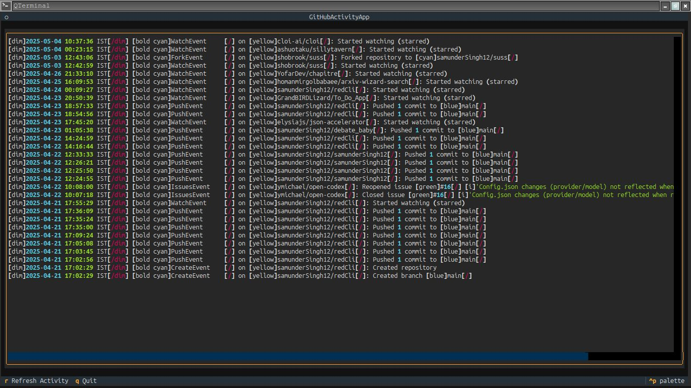

# GitHub TUI

A Terminal User Interface (TUI) for interacting with GitHub, built with Python and the [Textual](https://textual.textualize.io/) framework. The goal is to provide a terminal-based alternative for common GitHub actions like checking activity, notifications, and repositories.

## Screenshot





## Features

**Current:**
*   Tabbed interface:
    *   Activity (Shows recent public events - **Working**)
    *   Notifications (**Loads blank**)
    *   My Repos (**Loads blank**)
    *   Starred (**Loads blank**)
*   Fetches and displays your public GitHub activity feed.
*   Attempts to fetch Notifications, User Repositories (owned & collaborated), and Starred Repositories using the GitHub API.
*   Requires a GitHub Personal Access Token (PAT) for authentication.
*   Refresh data for the active tab (`r` key).
*   Basic status bar for loading messages and errors.

**Planned / Future Ideas:**
*   Fix the blank tab loading issue!
*   Pagination / "Load More" for lists (Notifications, Repos).
*   Interaction:
    *   Select items in lists.
    *   View details (e.g., open notification/repo URL, view README).
    *   Mark notifications as read.
    *   Star/unstar repositories.
*   Markdown rendering for READMEs, comments, etc.
*   Search and filtering within lists.
*   More detailed views (Issues, Pull Requests).

## 🚨 The Problem: Blank Tabs 🚨

Currently, while the application runs and the "Activity" tab populates correctly, the **"Notifications", "My Repos", and "Starred" tabs remain blank** even after trying to refresh (`r`).

*   **What we know:**
    *   The basic TUI structure (Tabs, Header, Footer, Status Bar) works.
    *   The API call for the public *Activity* feed works and displays correctly.
    *   Background workers *seem* to be triggered when switching tabs or refreshing (based on debug prints).
    *   Error messages (like PAT scope issues, network errors) *are* sometimes displayed in the status bar or printed to the terminal, indicating the fetch workers *are* running and catching exceptions.
*   **What's likely going wrong:**
    *   There might be a problem in how the fetched data (or errors) for Notifications/Repos are passed back from the background worker thread to the main UI thread via Textual messages (`NotificationsFetched`, `ReposFetched`).
    *   The UI update logic within the message handlers (`on_notifications_fetched`, `on_repos_fetched`) might be failing silently or incorrectly, preventing the `ListView` widgets from being populated even if data is received.
    *   There could still be subtle API permission/scope issues even if the PAT *seems* correct.
    *   Potential compatibility issues with the specific Textual version being used.

**This is the primary issue where help is needed!**

## 🙏 Call for Contributions 🙏

We need help diagnosing and fixing the blank screen issue for the Notifications and Repos tabs! If you're familiar with Python, `asyncio`, `requests`, or especially the Textual framework, your help would be greatly appreciated.

Contributions for other features or bug fixes are also welcome!

**How to Help:**
1.  **Clone & Setup:** Follow the instructions below.
2.  **Reproduce:** Run the app and confirm you see the blank tabs.
3.  **Debug:**
    *   Run with `textual run --dev github_activity.py` for Textual's built-in dev tools.
    *   Examine the `DEBUG:` and `ERROR:` output printed to your terminal.
    *   Add more `print()` statements or use a debugger (`pdb`, `ipdb`) to trace the flow, especially around:
        *   The `_run_worker` calls.
        *   The `fetch_...` worker functions (did they complete? did they get data?).
        *   The `self.post_message(...)` calls.
        *   The `on_..._fetched` message handlers (are they triggered? is `message.error` set? is `message.data` valid? does the UI update code run?).
4.  **Propose a Fix:** Submit a Pull Request with your solution!

## Codebase Overview

The project consists mainly of two files:

1.  **`github_activity.py`**: The core application logic.
    *   **`GitHubTUIApp(App)`**: The main Textual application class.
        *   `compose()`: Defines the static layout of the UI (Header, Footer, `TabbedContent`, `LoadingIndicator`, `Static` status bar, placeholder widgets like `Log` and `ListView` for each tab).
        *   `on_mount()`, `on_tabbed_content_tab_activated()`: Event handlers that trigger data loading for tabs when the app starts or a tab is switched.
        *   `_load_data_for_tab()`: Helper function to decide *which* data fetching worker to start based on the active tab ID.
        *   `fetch_activity()`, `fetch_notifications()`, `fetch_repos()`: `async` methods that run as background tasks (workers via `self.run_worker`). They use `_fetch_data` to make the API call.
        *   `_fetch_data()`: A synchronous helper function that uses the `requests` library to make the actual HTTP GET call to the GitHub API and handles basic HTTP errors. It's run within an executor by the async `fetch_...` methods to avoid blocking the main async loop.
        *   `on_activity_fetched()`, `on_notifications_fetched()`, `on_repos_fetched()`: Message handlers. These methods are called automatically when a background worker finishes and posts a message (e.g., `ActivityFetched`). They receive the fetched data (or an error) and are responsible for updating the UI widgets (`Log`, `ListView`). **Investigating these handlers and the message passing is crucial for the current bug.**
        *   `*Item(ListItem)` classes (`NotificationItem`, `RepoItem`): Custom Textual `ListItem` widgets used to display formatted data within the `ListView`s.
        *   `update_status()`, `watch_loading()`: Methods to update the status bar text and control the loading indicator visibility.
2.  **`github_activity.css`**: Defines the styling and layout adjustments using Textual's CSS dialect.
3.  **`.env`**: Stores your GitHub username and Personal Access Token (PAT). **Do not commit this file!**

**Key Libraries:**
*   `textual`: The TUI framework.
*   `requests`: For making HTTP requests to the GitHub API.
*   `python-dotenv`: For loading credentials from the `.env` file.

## Setup and Installation

1.  **Prerequisites:**
    *   Python 3.7+
    *   Git

2.  **Clone the repository:**
    ```bash
    git clone <repository-url>
    cd <repository-directory>
    ```

3.  **Create and activate a virtual environment (Recommended):**
    ```bash
    python -m venv .venv
    source .venv/bin/activate  # On Windows use `.venv\Scripts\activate`
    ```

4.  **Install dependencies:**
    ```bash
    pip install textual requests python-dotenv
    ```

5.  **Create GitHub Personal Access Token (PAT):**
    *   Go to GitHub -> Settings -> Developer settings -> Personal access tokens -> Tokens (classic).
    *   Generate a new token.
    *   Give it a name (e.g., "GitHub TUI").
    *   Set an expiration date.
    *   **Crucially, select the following scopes:**
        *   `repo` (Full control of repositories - needed to list private/public/collaborator repos)
        *   `notifications` (To read notifications)
    *   Generate the token and **copy it immediately**.

6.  **Create `.env` file:**
    *   Create a file named `.env` in the project root directory.
    *   Add your GitHub username and the PAT you just copied:
        ```dotenv
        GITHUB_USER="your-github-username"
        GITHUB_TOKEN="ghp_YOUR_COPIED_TOKEN_HERE"
        ```
    *   **Ensure `.env` is listed in your `.gitignore` file!**

## Usage

1.  Make sure your virtual environment is activated.
2.  Run the application:
    ```bash
    python github_activity.py
    ```
    *Or for debugging:*
    ```bash
    textual run --dev github_activity.py
    ```

3.  **Key Bindings:**
    *   `q`: Quit
    *   `r`: Refresh the current tab's content
    *   `Tab` / `Shift+Tab`: Switch between tabs (may depend on terminal)
    *   Arrow Keys / PgUp / PgDn: Scroll content within tabs.
4.  **Check Terminal:** Monitor the terminal where you launched the script for `DEBUG:` and `ERROR:` messages, especially when switching/refreshing the non-working tabs.

## Contributing

Contributions are welcome! Please focus on fixing the blank tab issue first.

1.  Fork the repository.
2.  Create a new branch (`git checkout -b feature/your-feature-name` or `bugfix/fix-blank-tabs`).
3.  Make your changes.
4.  Commit your changes (`git commit -am 'Add some feature'`).
5.  Push to the branch (`git push origin feature/your-feature-name`).
6.  Create a new Pull Request.

Please provide a clear description of the problem you're solving or the feature you're adding.

## License

[MIT License]
